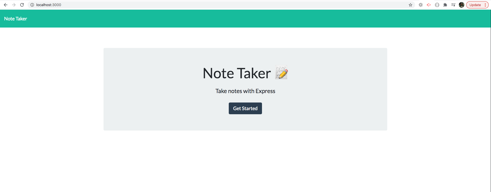
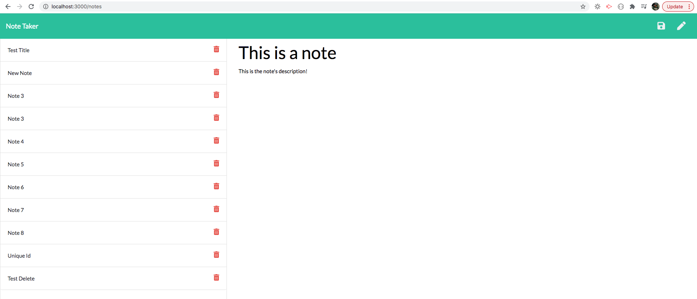

# Note Taker

## Description

This is a note taker application that allows a user to create, read, and delete notes. The purpose of this project is to demonstrate my ability to work in the back-end by building a web server. Given the front-end code, my duty was to build a server that would connect both the front-end and the back-end of the project. This project also features the use of [Express.js](https://expressjs.com/) and [Node.js](https://nodejs.org/en/).

Project Deployed on [Heroku](https://young-harbor-17190.herokuapp.com/)

## Table of Contents

* [Description](#description)
* [License](#license)
* [Installation](#installation)
* [Usage](#usage)
* [Contributors](#contributors)
* [Tests](#tests)
* [Questions](#questions)
    
## License

License chosen: MIT.
More information about the license chosen can be found on [Open Source Initiative](https://opensource.org/licenses/MIT).
    
## Installation

No installation required. The project is deployed on Heroku (see above for deployed link). However the user can clone this repo onto their local machine and run it on localhost. To do so, once the user has cloned the repo, they need to navigate into the directory and run `node server.js` in either Terminal or GitBash depending on the user's OS, or they can use the integrated command-line in VS Code.

## Usage

To start the application, on the homepage, the user needs to click on the "Get Started" button. 

From here, the usage of this project is to let a user keep track of notes and to create new notes. There is also a feature to delete notes once the note is no longer needed.

## Contributors

[eroux13](https://www.github.com/eroux13)

## Tests

There are currently no tests for this project.

## Questions

Feel free to follow my GitHub [profile](https://www.github.com/eroux13).
If you have any questions about this project, please reach out to me via ej.roux13@gmail.com.